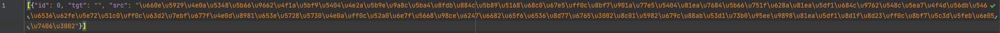

# BertSum

## 数据预处理

### Step 1 下载原始数据 

下载LCSTS2.0原始数据，下载途径。将 `LCSTS2.0/DATA` 目录下所有 **`PART_*.txt`** 文件放入 `BertSum-master_Chinese/raw_data` 


### Step 2 将原始文件转换成json文件存储

`BertSum-master_Chinese/src`目录下，运行：

```
python preprocess_LAI.py -mode format_raw -raw_path ../raw_data -save_path ../raw_data -log_file ../logs/preprocess.log
```


### Step 3 分句分词 & 分割文件 & 进一步简化格式

* 分句分词：首先按照符号['。', '！', '？']分句，若得到的句数少于2句，则用['，', '；']进一步分句

* 分割文件：训练集文件太大，分割成小文件便于后期训练。**分割后，每个文件包含不多于16000条记录**

`BertSum-master_Chinese/src` 目录下运行如下命令，会生成在 `../json_data/LCSTS` 目录下

```
python preprocess_LAI.py -mode format_to_lines -raw_path ../raw_data -save_path ../json_data/LCSTS -log_file ../logs/preprocess.log
```

注：这个过程相对耗时较长


### Step 4 句子标注 & 训练前预处理

* 句子预处理：找出与参考摘要最接近的n句话(相似程度以ROUGE衡量)，标注为1(属于摘要)

```
python preprocess_LAI.py -mode format_to_bert -raw_path ../json_data -save_path ../bert_data -oracle_mode greedy -n_cpus 2 -log_file ../logs/preprocess.log
```

会以.pt形式的文件生成在 `Text-Summarization/BertSum-Chinese/bert_data` 目录下

注：这个过程相对耗时较长


## 模型训练

注：第一次训练的时候可能会自动执行预训练模型下载等操作，现在把代码里面用到tokenizer的地方都改成了transformer(huggingface)的写法了；

在 `BertSum-master_Chinese/src` 目录下执行下列训练脚本，其中**三行代码区别是参数 -encoder设置了不同值(classifier & transformer & rnn)分别代表三种不同的摘要层**，这里还暂时没有全部调通；

### BERT+Classifier model

```shell
sh BertSum-Chinese/src/BERT-Classifier-train.sh
```

输出的checkpoint保存在 `BertSum-Chinese/models/bert_classifier` 路径下


### 模型提供了续接训练的能力

以BERT-Classifier为例，续接命令如下所示：

```shell
python train_LAI.py -mode train -encoder classifier -dropout 0.1 -bert_data_path ../bert_data/LCSTS -model_path ../models/bert_classifier -lr 2e-3 -visible_gpus 1 -gpu_ranks 0 -world_size 1 -report_every 50 -save_checkpoint_steps 1000 -batch_size 3000 -decay_method noam -train_steps 30000 -accum_count 2 -log_file ../logs/bert_classifier -use_interval true -warmup_steps 10000 \
../models/bert_classifier/model_step_xxxxx.pt 
```


## 模型评估/预测

模型训练完毕后，`BertSum-master_Chinese/src` 目录下，运行：

```shell
python train_LAI.py \
-mode test \
-bert_data_path ../bert_data/LCSTS \
-model_path MODEL_PATH \
-visible_gpus 1 \
-gpu_ranks 0 \
-batch_size 30000 \
-log_file LOG_FILE \
-result_path ../results/LCSTS \
-test_all \
-block_trigram False \
-test_from ../models/bert_transformer/model_step_30000.pt
```

- `MODEL_PATH` 是储存checkpoints的目录
- `RESULT_PATH` is where you want to put decoded summaries (default `../results/LCSTS`)

**中途自己环境遇到的bug解决**

pyrouge报错找不到settings.ini，在src目录下git clone一个新的ROUGE，然后设置pyrouge_set_rouge_path
```shell
(h1_abc_base) lyx@h5:/data/sdb1/lyx/Text-Summarization/BertSum-Chinese/src$ pyrouge_set_rouge_path /data/sdb1/lyx/Text-Summarization/BertSum-Chinese/src/pyrouge/tools/ROUGE-1.5.5
2022-03-29 21:26:45,158 [MainThread  ] [INFO ]  Set ROUGE home directory to /data/sdb1/lyx/Text-Summarization/BertSum-Chinese/src/pyrouge/tools/ROUGE-1.5.5.
(h1_abc_base) lyx@h5:/data/sdb1/lyx/Text-Summarization/BertSum-Chinese/src$ 
```

CalledProcessError: returned non-zero exit status - https://github.com/tagucci/pythonrouge/issues/4
```shell
cd pythonrouge/RELEASE-1.5.5/data/
rm WordNet-2.0.exc.db
./WordNet-2.0-Exceptions/buildExeptionDB.pl ./WordNet-2.0-Exceptions ./smart_common_words.txt ./WordNet-2.0.exc.db
```

BertConfig相关的一些错误：
- train_LAI.py中的训练和预测过程可能需要稍微调整下，训练用下边一行，测试用上边一行
  - from pytorch_pretrained_bert import BertConfig
  - from transformers import BertConfig


### for BERT+Classifier model

```shell
sh BERT-Classifier-eval.sh
```

输出结果在 `/data/sdb1/lyx/Text-Summarization/BertSum-Chinese/results/LCSTS_step10000.candidate`


## 使用自己的数据进行预测

### Step1 把自己的待摘要文本转化为Unicode编码（未来可以使用脚本解决）

raw
```
明天上午学院会对各个实验室进行安全检查，请通知各自的学生把自己桌面和座位四周收拾干净，插线板不要放在地上，加湿器风扇暂时收起来。谁如果被发现问题自己负责，请尽快清理。
```

unicode
```
\u660e\u5929\u4e0a\u5348\u5b66\u9662\u4f1a\u5bf9\u5404\u4e2a\u5b9e\u9a8c\u5ba4\u8fdb\u884c\u5b89\u5168\u68c0\u67e5\uff0c\u8bf7\u901a\u77e5\u5404\u81ea\u7684\u5b66\u751f\u628a\u81ea\u5df1\u684c\u9762\u548c\u5ea7\u4f4d\u56db\u5468\u6536\u62fe\u5e72\u51c0\uff0c\u63d2\u7ebf\u677f\u4e0d\u8981\u653e\u5728\u5730\u4e0a\uff0c\u52a0\u6e7f\u5668\u98ce\u6247\u6682\u65f6\u6536\u8d77\u6765\u3002\u8c01\u5982\u679c\u88ab\u53d1\u73b0\u95ee\u9898\u81ea\u5df1\u8d1f\u8d23\uff0c\u8bf7\u5c3d\u5feb\u6e05\u7406\u3002
```

将unicode编码替换json文件里面的 `BertSum-Chinese/raw_data/LCSTS_test.json`，注意这里tgt需要随便写一些，比如"占位占位"


执行数据预处理步骤中的step3 step4，执行之前可以先清空之前的文件 `/data/sdb1/lyx/Text-Summarization/BertSum-Chinese/json_data` `/data/sdb1/lyx/Text-Summarization/BertSum-Chinese/bert_data`

重新生成后，只保留 
- `/data/sdb1/lyx/Text-Summarization/BertSum-Chinese/json_data/LCSTS.test.0.json`
- `/data/sdb1/lyx/Text-Summarization/BertSum-Chinese/bert_data/LCSTS.test.0.bert.pt`

